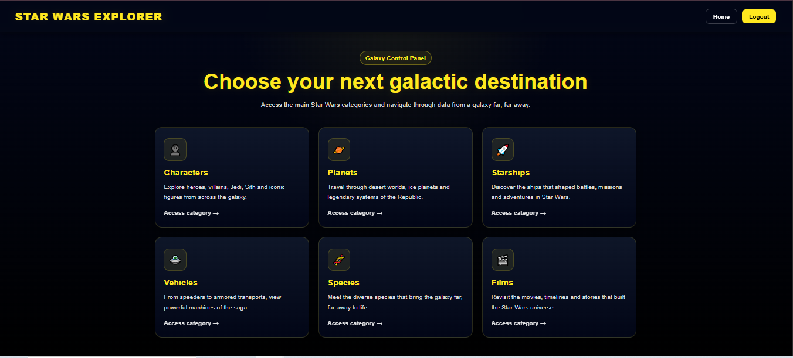
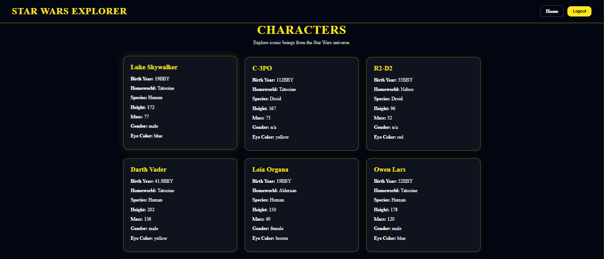

# 🚀 Star Wars API - Fullstack

API REST desenvolvida com **Node.js, Express e MongoDB Atlas** para gerenciamento de dados do universo Star Wars, com **frontend em React** para consumo dos dados.

---

## 📸 Application Preview

### 🏠 Home


### 📊 Dashboard



### 🔌 API (Insomnia)



---

## 📌 Objetivo

Este projeto foi desenvolvido como parte da disciplina **Desenvolvimento Web III**, com o objetivo de criar uma API REST completa com integração ao MongoDB e consumo via frontend.

- backend com API REST
- integração com MongoDB Atlas
- frontend para consumo da API
- autenticação com JWT
- documentação interativa com Swagger

---

## 🛠️ Tecnologias utilizadas

### 🔧 Backend

- Node.js
- Express
- MongoDB Atlas
- Mongoose
- Dotenv
- JSON Web Token (JWT)
- Swagger UI Express

### 🎨 Frontend

- React
- Vite
- Axios

### 🧪 Ferramentas

- Insomnia
- Swagger
- Git e GitHub
- MongoDB Atlas

---

## 📂 Estrutura do projeto

```text
ATV01_API_STAR_WARS/
│
├── backend-star-wars/
│   ├── controllers/
│   ├── middleware/
│   ├── models/
│   ├── routes/
│   ├── services/
│   ├── swagger.js
│   ├── index.js
│   └── package.json
│
├── frontend-star-wars/
│   ├── src/
│   ├── components/
│   ├── pages/
│   └── package.json
│
├── assets/
│   ├── screenshot-home.png
│   ├── screenshot-dashboard.png
│   └── screenshot-api.png
│
├── package.json
└── README.md
```

---

## ⚙️ Como executar o projeto

### 1. Clonar o repositório

```bash
git clone https://github.com/toledorp/ATV01_API_STAR_WARS.git
```

---

### 2. Instalar dependências

#### Backend

```bash
cd backend-star-wars
npm install
```

#### Frontend

```bash
cd ../frontend-star-wars
npm install
```

---

### 3. Configurar variáveis de ambiente

Crie um arquivo `.env` dentro da pasta **backend-star-wars**:

```env
MONGODB_URI=sua_string_do_mongodb_atlas
JWT_SECRET=sua_chave_secreta
PORT=4000
```

---

### 4. Executar aplicação

Na raiz do projeto:

```bash
npm run dev
```

- Backend: http://localhost:4000
- Frontend: http://localhost:5173

---

## 🔗 Endpoints da API

### 🎬 Filmes

- GET `/films` → lista todos os filmes
- GET `/films/:id` → busca por id
- POST `/films` → cria filme
- PUT `/films/:id` → atualiza filme
- DELETE `/films/:id` → remove filme

---

### 👤 Personagens

- GET `/persons` → lista todos
- GET `/persons/:id` → busca por id
- POST `/persons` → cria personagem
- PUT `/persons/:id` → atualiza
- DELETE `/persons/:id` → remove

---

### 🌍 Planetas

- GET `/planets` → lista todos
- GET `/planets/:id` → busca por id
- POST `/planets` → cria planeta
- PUT `/planets/:id` → atualiza
- DELETE `/planets/:id` → remove

---

### 🧬 Species

- GET `/species` → lista todos
- GET `/species/:id` → busca por id
- POST `/species` → cria species
- PUT `/species/:id` → atualiza
- DELETE `/species/:id` → remove

---

### 🛸 Vehicles

- GET `/vehicles` → lista todos
- GET `/vehicles/:id` → busca por id
- POST `/vehicles` → cria vehicle
- PUT `/vehicles/:id` → atualiza
- DELETE `/vehicles/:id` → remove

---

### 🚀 Starships

- GET `/starships` → lista todos
- GET `/starships/:id` → busca por id
- POST `/starships` → cria starship
- PUT `/starships/:id` → atualiza
- DELETE `/starships/:id` → remove

---

## 🧩 Exemplo de estrutura de dados (com aninhamento)

```json
{
  "name": "C-3PO",
  "birth_year": "112BBY",
  "homeworld": "Tatooine",
  "species": "Droid",
  "descriptions": {
    "height": 167,
    "mass": 75,
    "hair_color": "n/a",
    "skin_color": "gold",
    "eye_color": "yellow",
    "gender": "n/a"
  }
}
```

✔️ Atende ao requisito de documento aninhado solicitado no trabalho.

---

## 🧪 Testes da API

Os testes foram realizados utilizando o **Insomnia**, validando todos os endpoints de CRUD (Create, Read, Update e Delete).

---

## ☁️ Banco de dados

O banco de dados está hospedado na nuvem utilizando o **MongoDB Atlas**.

---

## 🎨 Protótipo do Frontend

```text
https://www.figma.com/proto/2KIfzXKWMaD8ZzBU6ABgr7/api_star-wars?node-id=0-1&t=ULhOFcygZzI4HqTi-1
```

---

## 🧠 Desafios enfrentados

- Configuração do MongoDB Atlas
- Conexão entre backend e banco de dados
- Estruturação de rotas REST
- Implementação do CRUD completo
- Integração entre frontend e backend
- Organização do projeto fullstack

---

## 📘 Documentação da API (Swagger)

A API possui documentação interativa utilizando **Swagger**, permitindo visualizar e testar todos os endpoints diretamente pelo navegador.

### 🔗 Acesso

http://localhost:4000/api-docs

---

## 🔐 Autenticação (JWT)

Algumas rotas da API são protegidas e exigem autenticação via **Bearer Token (JWT)**.

### 1. Criar usuário

POST /user

Exemplo de requisição:

{
  "name": "Luke Skywalker",
  "email": "luke@email.com",
  "password": "123456"
}

---

### 2. Realizar login

POST /auth

Exemplo de requisição:

{
  "email": "luke@email.com",
  "password": "123456"
}

Resposta esperada:

{
  "message": "Login realizado com sucesso",
  "token": "SEU_TOKEN_JWT"
}

---

### 3. Autorizar no Swagger

Após obter o token:

1. Clique no botão **Authorize**
2. Insira:

Bearer SEU_TOKEN_JWT

3. Clique em **Authorize**

Agora você poderá testar todas as rotas protegidas diretamente no Swagger.

---

## 📚 O que está documentado

- Cadastro de usuário
- Autenticação (login)
- CRUD de filmes
- CRUD de personagens
- CRUD de planetas
- CRUD de espécies
- CRUD de veículos
- CRUD de espaçonaves

---

## 🧪 Testes da API

A API pode ser testada utilizando:

- Swagger (interface interativa integrada)
- Insomnia (testes manuais dos endpoints)
---

## 👨‍💻 Autor(es)

- Camila Machado de Souza
- Ricardo Sugano
- Rogerio Pupo Toledo

---

## 📄 Licença

Este projeto é acadêmico e não possui fins comerciais.
